# 📘 README.md — *Kedastral*

> **Kedastral** — *Predict tomorrow’s load, scale today.*

---

## 🧭 Overview

**Kedastral** is an open-source, domain-agnostic **predictive autoscaling companion for [KEDA](https://keda.sh/)**, written in **Go**.

It enables Kubernetes workloads to **scale proactively**, not just reactively, by **forecasting future demand** (for example, request rate, queue depth, or events) and translating that forecast into desired replica counts **before** resource metrics like CPU or RPS spike.

Where **KEDA** reacts to what *has already happened*, **Kedastral** predicts *what will happen next* — keeping applications responsive, stable, and cost-efficient during sudden traffic surges.

---

## 🚀 Key Features

| Feature | Description |
|----------|-------------|
| 🔮 **Predictive scaling** | Forecast short-term demand and set replica counts ahead of time. |
| ⚙️ **KEDA-native integration** | Implements the official KEDA **External Scaler** gRPC interface — drop-in compatible. |
| 🧩 **Pluggable design** | Bring your own data sources and forecasting models — heuristic, statistical, or ML. |
| 🧠 **Built in Go** | Fast, efficient, minimal footprint; deployable as static binaries or containers. |
| 🧱 **Extensible SDKs** | Well-defined interfaces for adapters and models so anyone can extend Kedastral. |
| 🧾 **Declarative CRDs** | Kubernetes-native configuration (`ForecastPolicy`, `DataSource`). |
| 🔐 **Data stays local** | No external calls — all forecasting and scaling happen *inside* your cluster. |
| 📊 **Observability-ready** | Exposes Prometheus metrics and ships with Grafana dashboards. |

---

## 💡 Example Use Cases

Kedastral is **domain-neutral**. You can use it for any workload that shows predictable or event-driven traffic patterns:

| Domain | Typical signals | Scaling goal |
|---------|------------------|--------------|
| E-commerce | request rate, promotions, time of day | scale before sales campaigns |
| Video streaming | viewer counts, release schedule | pre-scale for new show launches |
| Banking & fintech | batch job schedules, queue lag | prepare for end-of-month loads |
| IoT ingestion | connected devices count | absorb telemetry spikes gracefully |
| SaaS APIs & gaming | RPS, active sessions, time windows | prevent latency from scaling delays |

---

## 🏗️ Architecture Overview

Kedastral consists of **three main components**, all implemented in **Go** for performance and operational simplicity.

### 1. **Forecast Engine**

- Collects recent metrics from one or more **data sources** (Prometheus, Kafka, HTTP APIs, etc.).
- Uses a **forecasting model** (baseline heuristic, statistical, or machine learning) to predict short-term load.
- Translates predicted load into **desired replica counts** using a simple, configurable capacity model.

### 2. **External Scaler**

- Implements the [KEDA External Scaler gRPC API](https://keda.sh/docs/latest/concepts/external-scalers/).
- Periodically queries the Forecast Engine (directly or via Redis).
- Returns **desired replicas** to KEDA, which adjusts Kubernetes HPAs automatically.

### 3. **Custom Resource Definitions (CRDs)**

- `ForecastPolicy` — defines what to forecast, prediction horizon, lead time, and capacity configuration.
- `DataSource` — describes where metrics and features are fetched from.

The three components form a closed feedback loop:

```
Metrics → Forecast → Desired Replicas → KEDA → HPA → Workload
```

---

### 🧩 Component Diagram (ASCII)

```
┌────────────────────┐
│  Metrics Sources   │
│ (Prometheus, etc.) │
└─────────┬──────────┘
          │
          ▼
┌────────────────────┐
│  Kedastral         │
│  Forecast Engine   │  (Go)
│  • Collects data   │
│  • Forecasts load  │
│  • Outputs replicas│
└─────────┬──────────┘
          │ REST/gRPC
          ▼
┌────────────────────┐
│  Kedastral Scaler  │  (Go, gRPC)
│  • KEDA plugin     │
│  • Reports replicas│
└─────────┬──────────┘
          │
          ▼
┌────────────────────┐
│        KEDA        │
│   (HPA controller) │
└─────────┬──────────┘
          │
          ▼
┌────────────────────┐
│ Target Deployment  │
│   (User workload)  │
└────────────────────┘
```

### 🧭 Mermaid Diagram

```mermaid
flowchart TD
    A["Metrics Sources (Prometheus · Kafka · HTTP · Custom)"] --> B["Forecast Engine (Go)"]
    B --> C["Kedastral External Scaler (Go, gRPC)"]
    C --> D["KEDA Operator"]
    D --> E["Horizontal Pod Autoscaler"]
    E --> F["Target Deployment (User workload)"]
    D -.->|Reactive metrics| B
```



---

## 🧠 How It Works

1. **Data Collection:** Kedastral’s adapters pull short-term metrics and contextual features from your chosen data sources.
2. **Forecasting:** The engine runs a forecasting model to estimate load (RPS, queue length, etc.) for the next few minutes.
3. **Replica Calculation:** Using the configured capacity model, Kedastral computes how many pods will be required to handle that future load.
4. **Integration with KEDA:**
   - The Kedastral External Scaler exposes the forecast as a metric via gRPC.
   - KEDA reads it and updates the Horizontal Pod Autoscaler (HPA).
   - Your workload scales *before* demand arrives.

---

## 🚀 Quick Start

### Building from Source

```bash
# Clone the repository
git clone https://github.com/HatiCode/kedastral.git
cd kedastral

# Build both forecaster and scaler
make build

# Or build individually
make forecaster
make scaler

# Run tests
make test
```

### Running Locally

#### 1. Start the Forecaster

The forecaster generates predictions and exposes them via HTTP:

```bash
./bin/forecaster \
  -workload=my-api \
  -metric=http_rps \
  -prom-url=http://localhost:9090 \
  -prom-query='sum(rate(http_requests_total{service="my-api"}[1m]))' \
  -target-per-pod=100 \
  -headroom=1.2 \
  -min=2 \
  -max=50 \
  -lead-time=5m \
  -log-level=info
```

Check the forecast:
```bash
curl "http://localhost:8081/forecast/current?workload=my-api"
```

#### 2. Start the Scaler

The scaler implements the KEDA External Scaler gRPC interface:

```bash
./bin/scaler \
  -forecaster-url=http://localhost:8081 \
  -lead-time=5m \
  -log-level=info
```

The scaler exposes:
- gRPC on `:50051` for KEDA
- HTTP metrics on `:8082`

#### 3. Configure KEDA

Apply a ScaledObject to connect KEDA to Kedastral:

```yaml
apiVersion: keda.sh/v1alpha1
kind: ScaledObject
metadata:
  name: my-api-scaledobject
spec:
  scaleTargetRef:
    name: my-api
    kind: Deployment
  pollingInterval: 30
  minReplicaCount: 2
  maxReplicaCount: 50
  triggers:
    - type: external
      metadata:
        scalerAddress: kedastral-scaler:50051
        workload: my-api
```

### Deploying to Kubernetes

See the [examples/](./examples/) directory for complete Kubernetes deployment manifests:

- **[examples/deployment.yaml](./examples/deployment.yaml)** - Complete deployment for forecaster and scaler
- **[examples/scaled-object.yaml](./examples/scaled-object.yaml)** - KEDA ScaledObject configuration
- **[examples/README.md](./examples/README.md)** - Detailed usage guide with configuration tables and troubleshooting

Quick deploy:
```bash
kubectl apply -f examples/deployment.yaml
kubectl apply -f examples/scaled-object.yaml
```

---

## ⚙️ Example CRD Configuration

```yaml
apiVersion: kedastral.io/v1alpha1
kind: ForecastPolicy
metadata:
  name: api-forecast-policy
spec:
  targetRef:
    name: my-api
  metric: http_rps
  horizon: 30m
  leadTime: 5m
  capacity:
    targetPerPod: 200
    headroom: 1.2
    min: 2
    max: 50
  model:
    type: baseline
    quantile: 0.85
  sources:
    - name: rps
      type: prometheus
      query: sum(rate(http_requests_total[1m]))
```

---

## 🧰 Tech Stack

| Component | Technology |
|------------|-------------|
| Core language | **Go** (≥1.25) |
| API | gRPC + REST |
| Forecast models | Go (baseline), Python (optional plugin via HTTP) |
| Storage | Redis / in-memory / pluggable |
| Metrics | Prometheus |
| Deployment | Helm chart or Kustomize |
| Observability | Grafana dashboards |
| CI/CD | GitHub Actions |

---

## 🧱 Internal Go Modules

```
kedastral/
├─ cmd/
│  ├─ scaler/         # External Scaler binary (gRPC for KEDA)
│  └─ forecaster/     # Forecast Engine binary
├─ pkg/
│  ├─ adapters/       # Prometheus, Kafka, HTTP, File adapters
│  ├─ models/         # baseline, prophet, byom
│  ├─ capacity/       # replica math, lead-time logic, safety clamps
│  ├─ api/            # Protobuf + CRD definitions
│  └─ storage/        # Redis / in-memory implementations
├─ deploy/
│  ├─ helm/           # Helm chart for Kedastral
│  ├─ examples/       # Example ForecastPolicies
│  └─ grafana/        # Dashboards
├─ docs/
│  ├─ quickstart.md
│  ├─ architecture.md
│  ├─ extending.md
│  └─ forecasting.md
└─ LICENSE (Apache-2.0)
```

---

## 🔧 Installation

### Prerequisites

- Go 1.25 or later (for building from source)
- Kubernetes cluster (v1.20+)
- KEDA installed ([installation guide](https://keda.sh/docs/latest/deploy/))
- Prometheus running in the cluster

### From Source

```bash
# Clone and build
git clone https://github.com/HatiCode/kedastral.git
cd kedastral
make build

# Deploy to Kubernetes
kubectl apply -f examples/deployment.yaml
kubectl apply -f examples/scaled-object.yaml
```

### Using Makefile

```bash
make build           # Build both forecaster and scaler
make test            # Run all tests
make test-coverage   # Run tests with coverage report
make clean           # Remove build artifacts
make help            # Show all available targets
```

See the [examples/README.md](./examples/README.md) for detailed deployment instructions and configuration options.

---

## 📊 Observability

| Metric | Description |
|---------|--------------|
| `kedastral_predicted_value` | forecasted metric (e.g., RPS) |
| `kedastral_desired_replicas` | computed replica count |
| `kedastral_forecast_age_seconds` | staleness of forecast data |
| `kedastral_underprovision_seconds_total` | safety metric for missed forecasts |

---

## 🧩 Extensibility

- **Adapters SDK:** implement your own metric collectors (Go interfaces).
- **Model SDK:** plug in your own forecasting logic.
- **Storage SDK:** replace Redis with your preferred backend.
- **BYOM Mode:** expose an HTTP endpoint returning predictions; Kedastral will use it automatically.

Example interface:
```go
type ForecastModel interface {
    Train(ctx context.Context, data DataFrame) error
    Predict(ctx context.Context, horizon time.Duration) ([]float64, error)
}
```

---

## 🔄 Safety & Fallbacks

- Kedastral can run **hybrid scaling**:
  `effectiveReplicas = max(predicted, reactive)`
  ensuring reactive CPU/RPS-based scaling still applies.
- Built-in clamps: max scale-up/down rate per minute.
- Automatic fallback to KEDA’s default triggers if the forecast is stale or engine is down.

---

## 🧑‍💻 Project Goals

1. Provide a **pluggable, open predictive-scaling layer** for Kubernetes.
2. Empower developers to **forecast and pre-scale workloads** in any industry.
3. Keep **data and control within the user’s cluster**.
4. Remain **KEDA-compatible** and **Go-native**.
5. Grow an **open community** around predictive autoscaling research and practice.

---

## 🌍 License & Governance

- **License:** Apache-2.0
- **Repository:** `github.com/kedastral/kedastral`
- **Maintainers:** community-governed, CNCF-style steering model.
- **Contributions:** welcomed via PRs, adapters, or model integrations.

---

## 🗺️ Roadmap

| Milestone | Key Features |
|------------|---------------|
| **v0.1** | Forecast Engine + External Scaler + Prometheus adapter + baseline model |
| **v0.2** | Prophet + Redis + Helm chart + Grafana dashboards |
| **v0.3** | CRDs (ForecastPolicy/DataSource), BYOM plugin |
| **v0.4** | Multi-metric ensembles, safety clamps, hybrid mode |
| **v1.0** | Kedastral Operator + model registry + full conformance tests |

---

## ✨ Getting Started

```bash
# 1. Build Kedastral
make build

# 2. Deploy to Kubernetes
kubectl apply -f examples/deployment.yaml
kubectl apply -f examples/scaled-object.yaml

# 3. Monitor forecasts
kubectl logs -l component=forecaster -f
kubectl logs -l component=scaler -f

# 4. Check current forecast
kubectl port-forward svc/kedastral-forecaster 8081:8081
curl "http://localhost:8081/forecast/current?workload=my-api"
```

For detailed instructions, see the [Quick Start](#-quick-start) section above and [examples/README.md](./examples/README.md).

---

## 🧩 Summary for AI Assistants

**Project Name:** Kedastral
**Purpose:** Predictive autoscaling framework for Kubernetes built around KEDA
**Core Language:** Go
**Primary Components:** Forecast Engine, External Scaler (gRPC), Kubernetes CRDs
**Key Integrations:** KEDA, Prometheus, Redis
**Domain Scope:** Domain-agnostic (works for any workload)
**Mission:** Enable proactive scaling decisions in Kubernetes through forecasted metrics
**Deployment:** Helm chart
**Architecture Keywords:** predictive autoscaling, machine learning forecasting, Kubernetes operator, Go, gRPC, KEDA-compatible, CRDs, observability, modular adapters.
